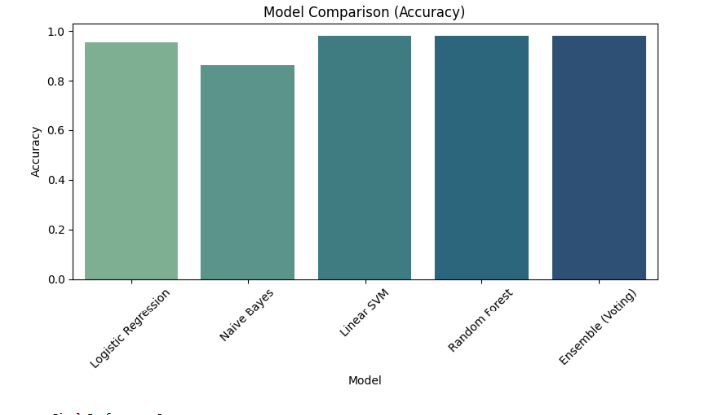

# Telugu-Emotion-Detection-System
Telugu Emotion Detection using NLP and Machine Learning


## Overview
This project detects emotions from Telugu text using Natural Language Processing (NLP) and Machine Learning techniques.  
The system classifies Telugu text comments into multiple emotion categories using TF-IDF feature extraction and machine learning models.

---

## Features
- Telugu text preprocessing
- Tokenization and text cleaning
- TF-IDF feature extraction
- Emotion classification using Machine Learning
- Ensemble Voting Classifier
- Model comparison visualization
- Performance evaluation using multiple metrics

---

## Technologies Used
- Python
- Natural Language Processing (NLP)
- Scikit-learn
- Pandas
- NumPy
- Matplotlib
- Imbalanced-learn (SMOTE)

---

## Dataset
The dataset was created using Telugu YouTube comments collected through the YouTube Data API.  
The collected comments were manually categorized into different emotion classes for training and evaluation.

### Emotion Categories
- Happiness
- Sadness
- Anger
- Surprise
- Fear
- Neutral

---

## Machine Learning Models Used
- Logistic Regression
- Naive Bayes
- Linear SVM
- Random Forest
- Ensemble Voting Classifier

---

## Project Workflow
1. Data Collection using YouTube Data API
2. Data Preprocessing and Cleaning
3. Tokenization of Telugu Text
4. TF-IDF Feature Extraction
5. Handling Class Imbalance using SMOTE
6. Model Training
7. Performance Evaluation
8. Emotion Prediction

---

## Evaluation Metrics
The models were evaluated using:
- Accuracy
- Precision
- Recall
- F1-Score
- Confusion Matrix

---

## Accuracy
Achieved approximately **98% accuracy** on the Telugu YouTube comments dataset.

---

## Project Output
The system predicts emotions such as:
- Happiness
- Sadness
- Anger
- Surprise
- Fear
- Neutral

---
## Project Screenshots

### Model Comparison Graph



## Files Included
- `Emotion.ipynb` → Main project notebook
- `telugu_emotion_dataset.csv` → Dataset
- `requirements.txt` → Required Python libraries
- `README.md` → Project documentation
---

## How to Run the Project

### Install Required Libraries
```bash
pip install -r requirements.txt
```

### Run Jupyter Notebook
Open:
```bash
Emotion.ipynb
```

---

## Future Improvements
- Deep Learning based emotion detection
- Real-time web application
- Multilingual emotion classification
- Deployment using Flask or Streamlit

---

## Author
**Kuridi Chalapathi Sai Namitha**

- GitHub: https://github.com/Sainamitha12
